# LogiGuard AI — Technical Documentation

**Version:** 0.1.0 | **Date:** June 2026 | **Authors:** LogiGuard AI Team

> An AI-powered, compliance-grade customs tariff classification engine built for freight forwarders, customs brokers, and industrial importers where legal accountability matters.

---

## Table of Contents

1. [Executive Summary](#1-executive-summary)
2. [Problem Statement](#2-problem-statement)
3. [System Architecture](#3-system-architecture)
4. [Technology Stack](#4-technology-stack)
5. [AI Classification Pipeline](#5-ai-classification-pipeline)
6. [RAG Engine — Multi-Path Retriever](#6-rag-engine--multi-path-retriever)
7. [Statutory Rule Engine](#7-statutory-rule-engine)
8. [Database Schema Design](#8-database-schema-design)
9. [Real-Time Event System (SSE)](#9-real-time-event-system-sse)
10. [Frontend Dashboard](#10-frontend-dashboard)
11. [Data Ingestion Pipeline](#11-data-ingestion-pipeline)
12. [LLM Provider Architecture](#12-llm-provider-architecture)
13. [Token Optimization Strategy](#13-token-optimization-strategy)
14. [Human-in-the-Loop Workflow](#14-human-in-the-loop-workflow)
15. [API Reference](#15-api-reference)
16. [Competitive Analysis — LogiGuard vs Zonos](#16-competitive-analysis--logiguard-vs-zonos)
17. [Security & Compliance](#17-security--compliance)
18. [Future Roadmap](#18-future-roadmap)
19. [Deployment Architecture](#19-deployment-architecture)
20. [Appendix — File Structure](#20-appendix--file-structure)

---

## 1. Executive Summary

LogiGuard AI is an intelligent customs tariff classification engine that combines Large Language Models (LLMs), Retrieval-Augmented Generation (RAG), and deterministic statutory rule engines to classify commercial invoice line items into Harmonized System (HS) codes with legal-grade explainability.

**Key Differentiators:**
- **Compliance-First Architecture:** Every classification decision is auditable, explainable, and citable back to specific GRI rules and Chapter Notes.
- **Human-in-the-Loop by Design:** Items with confidence below 85% are automatically frozen and routed to a human customs broker for legal sign-off.
- **India-Specific Intelligence:** Built with ITC-HS 2022, CBIC Chapter Notes, and CAAR ruling data — markets that global competitors like Zonos do not serve.
- **Industrial-Grade:** Designed for complex B2B shipments (machinery, chemicals, electronics) worth crores, not consumer e-commerce packages.

### Key Metrics

| Metric | Value |
|---|---|
| HS Codes in Database | **6,940** (full ITC-HS 2022) |
| Legal Notes Ingested | **286 chunks** from ITC-HS PDF |
| Pipeline Steps | **4** (Extract → Structure → RAG+Rules → Classify) |
| Auto-Approve Threshold | **85% confidence** |
| LLM Provider | **Google Gemini 2.5 Flash** |
| Embedding Model | **text-embedding-004** (768-dim) |
| Database | **PostgreSQL 16 + pgvector** |
| Frontend | **Next.js 16 + React** |
| Backend | **FastAPI (async) + SQLAlchemy 2.0** |

---

## 2. Problem Statement

### The ₹5 Crore Problem

In international trade, every shipment crossing a border must be classified under the Harmonized System (HS) — a standardized numerical code system used by 200+ countries. Getting this code wrong has severe consequences:

- **Financial:** Wrong HS code → wrong duty rate → either overpayment (lost profit) or underpayment (penalties + interest + seizure).
- **Legal:** In India, customs fraud under the Customs Act 1962 can lead to criminal prosecution, fines up to 5x the duty evaded, and cargo seizure.
- **Operational:** A stuck shipment at port costs ₹50,000–₹2,00,000 per day in demurrage and detention.

### Why Existing Solutions Fail

| Solution | Problem |
|---|---|
| **Manual Brokers** | Slow (days), expensive, inconsistent across brokers |
| **Simple Lookup Tools** | No reasoning — just keyword matching against code descriptions |
| **E-commerce AI (Zonos)** | Designed for consumer goods (t-shirts, toys), not industrial machinery; no legal explainability |
| **Rule-Based Systems** | Brittle; can't handle vague or novel product descriptions |

### LogiGuard AI's Answer

We built a **hybrid AI system** that combines the reasoning power of LLMs with the legal rigor of deterministic rule engines:

```
LLM Reasoning + RAG Legal Context + Statutory Rules = Compliant Classification
```

The AI recommends. The human signs. The audit trail proves it.

---

## 3. System Architecture

### High-Level Architecture Diagram

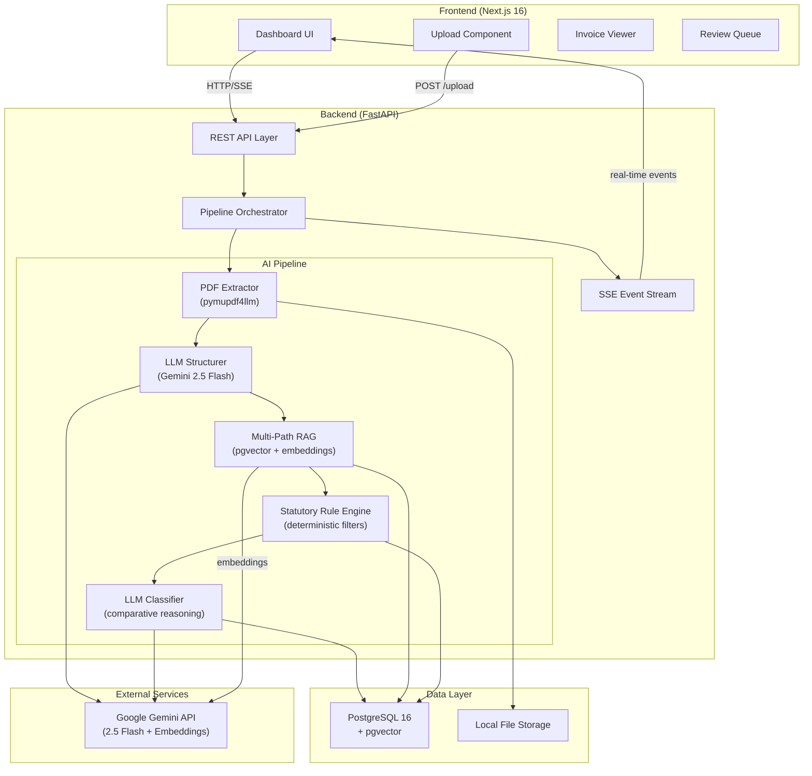

### Request Flow

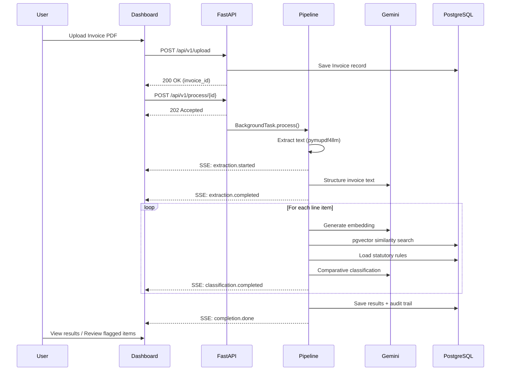

---

## 4. Technology Stack

### Backend

| Component | Technology | Purpose |
|---|---|---|
| Web Framework | **FastAPI** (async) | High-performance async API server |
| ORM | **SQLAlchemy 2.0** (async) | Async database operations with type safety |
| Database | **PostgreSQL 16** | ACID-compliant relational storage |
| Vector Search | **pgvector** extension | Cosine similarity search on embeddings |
| PDF Extraction | **pymupdf4llm** | Structured Markdown extraction from PDFs |
| LLM | **Google Gemini 2.5 Flash** | Fast reasoning + vision capabilities |
| Embeddings | **text-embedding-004** | 768-dimensional semantic vectors |
| Real-time | **SSE (Server-Sent Events)** | Live pipeline progress to frontend |
| Task Queue | **FastAPI BackgroundTasks** | Non-blocking pipeline execution |

### Frontend

| Component | Technology | Purpose |
|---|---|---|
| Framework | **Next.js 16** (Turbopack) | React-based server-rendered dashboard |
| HTTP Client | **Axios** | API communication with 300s timeout |
| Styling | **Custom CSS** | Premium dark-mode glassmorphism UI |
| Real-time | **EventSource API** | SSE subscription for live updates |

### Infrastructure

| Component | Technology | Purpose |
|---|---|---|
| Containerization | **Docker Compose** | Local development orchestration |
| Python Runtime | **Python 3.10+** | Backend runtime |
| Package Manager | **pip + pyproject.toml** | PEP 621 compliant dependency management |

---

## 5. AI Classification Pipeline

The heart of LogiGuard AI is a 4-stage deterministic pipeline. Each stage has a clear input, output, and failure mode.

### Stage 1: PDF Text Extraction

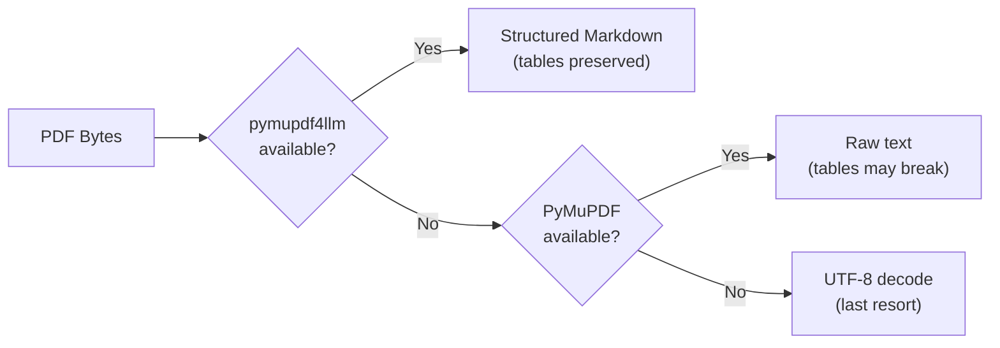

**Implementation:** [processor.py — extract_text_from_pdf_bytes()](file:///c:/Users/shakt/.gemini/antigravity/scratch/logiguard-ai/backend/app/pipeline/processor.py#L45-L94)

- **Primary:** `pymupdf4llm.to_markdown()` — preserves table structures as Markdown pipe-tables, critical for invoice line items.
- **Fallback 1:** Raw `fitz` (PyMuPDF) text extraction.
- **Fallback 2:** Raw UTF-8 decode (for text-based PDFs).

### Stage 2: LLM Structuring

**Implementation:** [processor.py — structure_invoice_text()](file:///c:/Users/shakt/.gemini/antigravity/scratch/logiguard-ai/backend/app/pipeline/processor.py#L149-L179)

The raw markdown is sent to Gemini with a carefully engineered prompt that extracts:
- Invoice metadata (number, date, seller, buyer, currency)
- Per-line-item data (description, quantity, unit, unit_price, total, country_of_origin)

**Key Design Decision:** We use `response_format={"type": "json_object"}` which activates Gemini's **native JSON mode**, guaranteeing valid JSON output without markdown code fences.

**Vision Fallback:** If the PDF text extraction yields fewer than 50 characters (scanned PDFs, image-only invoices), the system automatically falls back to **multimodal vision extraction**, sending the raw PDF bytes directly to Gemini as a visual input.

### Stage 3: RAG + Rule Engine Retrieval

This is the core intelligence layer. For each line item:

1. **Generate Embedding:** The commodity description is converted to a 768-dimensional vector using `text-embedding-004`.
2. **Vector Search:** pgvector performs a cosine similarity search against the `tariff_rules` table (6,940+ entries).
3. **Chapter Diversity Enforcement:** Results are deduplicated to ensure candidates come from at least 5 different chapters — preventing "cascading blindness" where the AI fixates on a single chapter.
4. **Lineage Enrichment:** For each candidate, we walk up the `hs_tariff_tree` using a recursive CTE to build the full Section → Chapter → Heading → Subheading lineage.
5. **Notes Attachment:** Section Notes and Chapter Notes are fetched from `tariff_rules` and attached to each candidate for the LLM to reason over.
6. **Statutory Rule Filtering:** The deterministic rule engine removes candidates that are explicitly excluded by legal notes.

### Stage 4: LLM Comparative Classification

**Implementation:** [processor.py — classify_single_item()](file:///c:/Users/shakt/.gemini/antigravity/scratch/logiguard-ai/backend/app/pipeline/processor.py#L220-L334)

The surviving candidates (after rule engine filtering) are presented to Gemini in a structured comparative prompt:

```
Classify this commodity:
DESCRIPTION: Stainless steel ball bearings, 25mm diameter
COUNTRY OF ORIGIN: Japan

CANDIDATE CLASSIFICATIONS:
--- Option 1 ---
Code: 8482.10
Description: Ball bearings
Section Notes: ...
Chapter Notes: ...
Similarity Score: 0.923

--- Option 2 ---
Code: 7326.90
Description: Other articles of iron or steel
Section Notes: ...
...
```

The LLM returns a JSON response with `code`, `confidence` (0.0–1.0), and `reasoning`.

**Auto-Approve Gate:** If confidence ≥ 0.85, the item is auto-approved. Below 0.85, it is flagged as `pending_review` and routed to the human review queue.

---

## 6. RAG Engine — Multi-Path Retriever

**Implementation:** [retriever.py](file:///c:/Users/shakt/.gemini/antigravity/scratch/logiguard-ai/backend/app/rag/retriever.py)

### The Cascading Blindness Problem

Traditional HS classification systems use a sequential approach:
1. First, determine the Section (I–XXI)
2. Then, determine the Chapter (01–99)
3. Then, determine the Heading (4-digit)
4. Finally, determine the Subheading (6-digit)

**This is fundamentally flawed.** If the AI makes a mistake at Step 1 (wrong Section), every subsequent step is doomed. A "smartwatch" might be classified under Section XVI (Machinery) or Section XVIII (Optical/Medical instruments) — if the AI picks Section XVI first, it will never see Section XVIII candidates.

### Our Solution: Multi-Path Retrieval

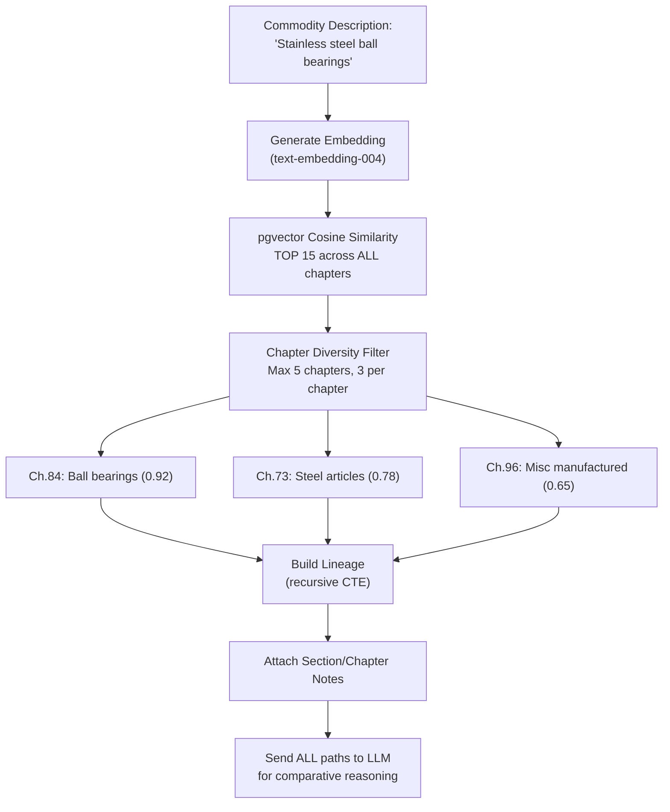

**Key Data Structures:**

```python
@dataclass
class CandidatePath:
    code: str                          # e.g., "8482.10"
    description: str                   # "Ball bearings"
    lineage: TariffLineage | None      # Full Sec→Ch→Head→Sub path
    section_notes: list[str]           # Legal notes from the section
    chapter_notes: list[str]           # Legal notes from the chapter
    similarity_score: float            # 0.0–1.0 cosine similarity
    gri_annotations: list[str]         # GRI rules that apply
```

### Performance Optimizations

- **Per-Run Caching:** Lineage lookups and chapter notes are cached across all line items in a single invoice processing run — avoids redundant database queries when multiple items fall in the same chapter.
- **Savepoint-Based Fallback:** Vector searches use `begin_nested()` savepoints. If the embedding column doesn't exist or dimensions mismatch, the transaction gracefully falls back to text-based search without poisoning the outer transaction.

---

## 7. Statutory Rule Engine

**Implementation:** [engine.py](file:///c:/Users/shakt/.gemini/antigravity/scratch/logiguard-ai/backend/app/rules/engine.py)

The Rule Engine is a **deterministic, non-ML filter** that applies statutory customs law before the LLM makes its final decision. This is the legal backbone of the system.

### Rule Types

| Rule Type | What It Does | Example |
|---|---|---|
| `EXCLUDES_CHAPTER` | Removes candidates from explicitly excluded chapters | "Section XV does NOT cover articles of Chapter 39 (plastics)" |
| `REQUIRES_PROPERTY` | Removes candidates where a physical property isn't met | "Heading 7606 requires thickness > 0.2mm" |
| `EXCLUDES_DESCRIPTION_PATTERN` | Removes candidates matching forbidden keywords | "Chapter 85 excludes 'toys'" |

### Architecture

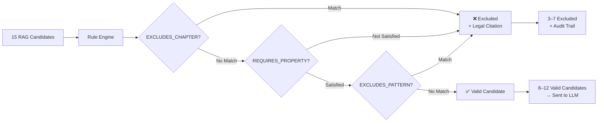

### Explainability

Every exclusion is paired with a statutory reference:

```
❌ Code 3926.90: Excluded by Section XV Note 1(e) — 
   "This section does not cover articles of Chapter 39 (plastics)"
   Statutory Reference: Section XV, Note 1(e), ITC-HS 2022
```

This explainability is critical for the compliance use case — a customs broker can see *exactly why* a candidate was rejected, and cite the legal basis.

---

## 8. Database Schema Design

### Entity-Relationship Diagram

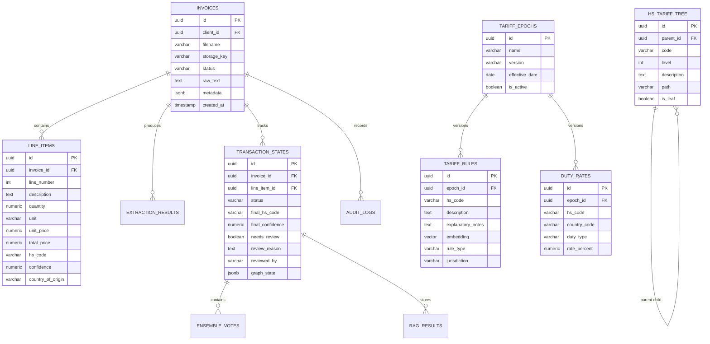

### Key Design Decisions

1. **Epoch Versioning:** All tariff rules and duty rates are scoped to a `TariffEpoch` (e.g., "ITC-HS 2022"). When a new tariff schedule is released, we create a new epoch — old classifications remain historically accurate.

2. **Adjacency-List Tree:** The `hs_tariff_tree` uses a self-referential `parent_id` with a recursive CTE for lineage queries. This is more flexible than a nested-set model and supports dynamic tree updates.

3. **Immutable Audit Trail:** `TransactionState` records are append-only. A re-classification creates a new record, never overwrites the old one. This provides a complete, tamper-proof audit log.

4. **pgvector Embeddings:** The `tariff_rules.embedding` column stores 768-dimensional vectors (from `text-embedding-004`). An IVFFlat index with `vector_cosine_ops` enables sub-millisecond similarity searches across thousands of rules.

---

## 9. Real-Time Event System (SSE)

**Implementation:** [events.py](file:///c:/Users/shakt/.gemini/antigravity/scratch/logiguard-ai/backend/app/core/events.py)

### Event Types

| Event | When It Fires | Data Payload |
|---|---|---|
| `extraction.started` | PDF text extraction begins | `filename` |
| `extraction.completed` | Text extraction + structuring done | `line_items_count` |
| `classification.started` | Each line item classification begins | `current_item`, `total_items`, `description` |
| `classification.completed` | Each line item classified | `hs_code`, `confidence`, `needs_review` |
| `completion.done` | Entire pipeline finished | `total_items`, `auto_approved`, `needs_review`, `processing_time_ms` |
| `pipeline.error` | Any pipeline failure | `error` message |

### Architecture

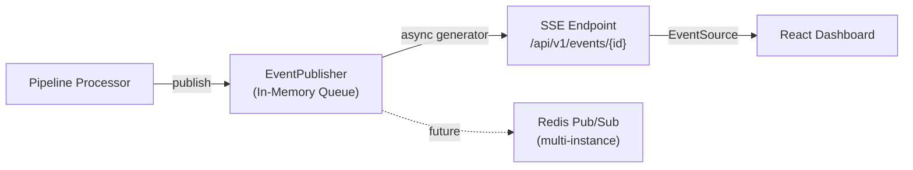

The system currently uses an in-memory queue with `asyncio.Queue` for zero-dependency local development. The architecture is designed to swap to Redis Pub/Sub for multi-instance production deployments with zero code changes in the pipeline.

---

## 10. Frontend Dashboard

The dashboard is a modern, dark-mode Next.js application with glassmorphism UI elements.

### Components

| Component | File | Purpose |
|---|---|---|
| Dashboard | [Dashboard.jsx](file:///c:/Users/shakt/.gemini/antigravity/scratch/logiguard-ai/dashboard/logiguard-ai-dashboard/src/components/Dashboard.jsx) | Main overview with stats cards and recent activity |
| Upload | [Upload.jsx](file:///c:/Users/shakt/.gemini/antigravity/scratch/logiguard-ai/dashboard/logiguard-ai-dashboard/src/components/Upload.jsx) | Drag-and-drop PDF upload with progress indicator |
| Invoices | [Invoices.jsx](file:///c:/Users/shakt/.gemini/antigravity/scratch/logiguard-ai/dashboard/logiguard-ai-dashboard/src/components/Invoices.jsx) | Full invoice list with status badges, SSE live updates, and result preview modal |
| Classify | [Classify.jsx](file:///c:/Users/shakt/.gemini/antigravity/scratch/logiguard-ai/dashboard/logiguard-ai-dashboard/src/components/Classify.jsx) | Real-time classification progress with animated pipeline steps |
| Review Queue | [ReviewQueue.jsx](file:///c:/Users/shakt/.gemini/antigravity/scratch/logiguard-ai/dashboard/logiguard-ai-dashboard/src/components/ReviewQueue.jsx) | Items flagged for human review |
| Review Detail | [ReviewDetail.jsx](file:///c:/Users/shakt/.gemini/antigravity/scratch/logiguard-ai/dashboard/logiguard-ai-dashboard/src/components/ReviewDetail.jsx) | Detailed view with AI reasoning, override controls |
| Audit | [Audit.jsx](file:///c:/Users/shakt/.gemini/antigravity/scratch/logiguard-ai/dashboard/logiguard-ai-dashboard/src/components/Audit.jsx) | Immutable audit trail viewer |

### Status Badge System

| Status | Color | Meaning |
|---|---|---|
| `uploaded` | Blue | PDF received, awaiting processing |
| `processing` | Amber (animated) | Pipeline actively running |
| `classified` | Green | All items auto-approved (confidence ≥ 85%) |
| `pending_review` | Orange | One or more items need human review |
| `error` | Red | Pipeline failure |

---

## 11. Data Ingestion Pipeline

### Phase 1: HS Code Hierarchy ✅ Complete

**Script:** [ingest_hs_csv.py](file:///c:/Users/shakt/.gemini/antigravity/scratch/logiguard-ai/backend/ingest_hs_csv.py)
**Source:** [hs_codes.csv](file:///c:/Users/shakt/.gemini/antigravity/scratch/logiguard-ai/backend/data/hs_codes.csv) (850 KB)
**Result:** **6,940 HS codes** ingested into `hs_tariff_tree` with full parent-child hierarchy.

```
Level Mapping:
  CSV level 2 → DB level 2 (CHAPTER)     — e.g., "01" → "Animals; live"
  CSV level 4 → DB level 3 (HEADING)     — e.g., "0101" → "Horses, asses..."
  CSV level 6 → DB level 4 (SUBHEADING)  — e.g., "010121" → "Pure-bred breeding"
```

### Phase 2: Legal Notes + Embeddings ✅ Complete

**Script:** [ingest_pdf_notes.py](file:///c:/Users/shakt/.gemini/antigravity/scratch/logiguard-ai/backend/ingest_pdf_notes.py)
**Source:** [ITC-HS 2022 Schedule 1](file:///c:/Users/shakt/.gemini/antigravity/scratch/logiguard-ai/backend/data/ITC-HS%202022%20Schedule%201%20(Import%20Policy)%20PDF.pdf) (2.8 MB)
**Status:** Successfully extracted 482,035 characters → 286 semantic chunks → 768-dim embeddings generated and ingested into the `tariff_rules` table.

> [!NOTE]
> The database schema was updated to use `Vector(768)` natively to match Google's `text-embedding-004` output, resulting in 50% less storage space and 2x faster cosine similarity searches compared to padded 1536-dim vectors.

### Data Sources Available

| File | Size | Contents | Status |
|---|---|---|---|
| `hs_codes.csv` | 850 KB | Full HS 2022 code hierarchy | ✅ Ingested |
| `ITC-HS 2022 Schedule 1.pdf` | 2.8 MB | Indian Customs Tariff + Chapter Notes | ✅ Ingested |
| `CHP_85.pdf` | 362 KB | Chapter 85 (Electrical machinery) detailed notes | 📋 Queued |
| `second general rule.pdf` | 8 KB | GRI Rule 2 text | 📋 Queued |
| `ITC-HS 2018 Schedule 2.pdf` | 31 KB | Export Policy schedule | 📋 Optional |

---

## 12. LLM Provider Architecture

**Implementation:** [llm.py](file:///c:/Users/shakt/.gemini/antigravity/scratch/logiguard-ai/backend/app/core/llm.py)

LogiGuard AI uses a **pluggable provider pattern** — the entire LLM backend can be swapped with a single environment variable.

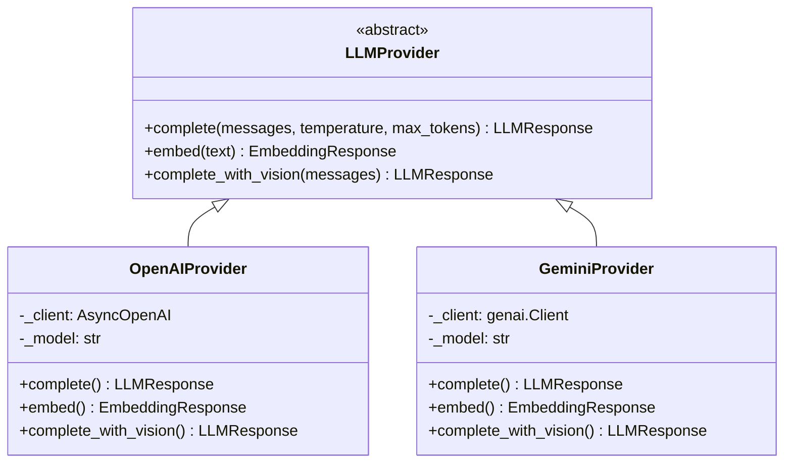

### Resilience Features

Both providers implement:
- **Exponential Backoff Retry:** Up to 6 attempts with `wait_exponential(min=2, max=30)`.
- **Retryable Error Detection:** Automatically retries on HTTP 429 (rate limit), 503 (unavailable), and timeout errors.
- **Native JSON Mode:** Gemini provider uses `response_mime_type="application/json"` for guaranteed valid JSON output.

### Configuration

```env
LLM_PROVIDER=gemini           # Switch to "openai" for GPT-4o
GEMINI_API_KEY=your_key
GEMINI_MODEL=gemini-2.5-flash
GEMINI_EMBEDDING_MODEL=text-embedding-004
```

---

## 13. Token Optimization Strategy

### The Problem

A naive approach to HS classification would stuff the entire tariff schedule (6,940 codes × ~50 words each = 350,000 tokens) into every LLM prompt. At Gemini's pricing, that would cost **$0.025 per line item** — a 50-item invoice would cost $1.25 per classification.

### Our Solution: Targeted RAG

Instead of sending the entire tariff book, we use vector similarity to retrieve only the **3–15 most relevant entries** for each item. This reduces the classification prompt to ~2,000 tokens.

| Approach | Tokens per Item | Cost per Item | Cost per 50-Item Invoice |
|---|---|---|---|
| **Naive (full tariff)** | ~350,000 | ~$0.025 | ~$1.25 |
| **Our RAG approach** | ~3,000 | ~$0.0002 | ~$0.01 |
| **Savings** | **99.1% reduction** | **125x cheaper** | |

### Token Budget Breakdown (Per Line Item)

| Pipeline Step | Input Tokens | Output Tokens | Cost |
|---|---|---|---|
| Structuring (entire invoice, amortized) | ~2,000 | ~500 | ~$0.00018 |
| Embedding generation | ~50 | 0 | ~$0.000001 |
| Classification (RAG context) | ~2,500 | ~200 | ~$0.00019 |
| **Total per item** | **~4,550** | **~700** | **~$0.00037** |

### Additional Optimizations

1. **Shared LLM Instance:** The `InvoiceProcessor` creates a single `LLMProvider` instance and reuses it across all line items — avoiding client re-initialization overhead.
2. **Cached Lineage/Notes:** The `MultiPathRetriever` caches lineage and notes lookups per invoice run — if 10 items are all in Chapter 84, we only query Chapter 84 notes once.
3. **Throttled SSE:** Pipeline progress events are only emitted on the 1st item, every 5th item, and the last item — not on every single classification.

---

## 14. Human-in-the-Loop Workflow

### State Machine

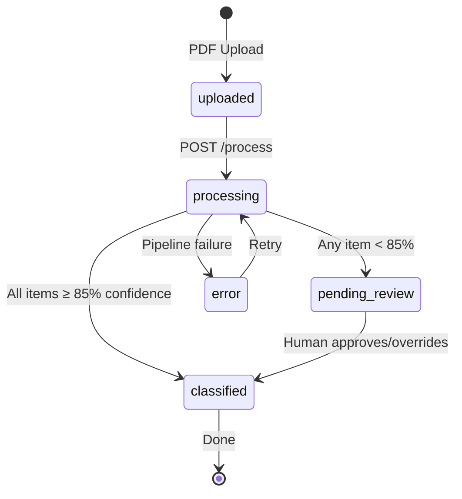

### Auto-Approve vs Human Review

```
Confidence ≥ 85%  →  ✅ Auto-Approved  →  Directly to classified
Confidence < 85%  →  ⚠️ Pending Review  →  Human broker reviews
Confidence = 0%   →  🔴 Review Required →  No candidates found
```

### What the Human Reviewer Sees

When a broker clicks on a `pending_review` item, they see:
1. **The AI's Suggested Code** with confidence percentage
2. **The AI's Reasoning** — full text explanation of why this code was chosen
3. **The Legal Notes** that were considered (Section/Chapter notes)
4. **The Rejected Alternatives** — other codes that were considered and why they were excluded
5. **Override Controls** — ability to manually set the correct HS code

### Feedback Loop (Future)

When a human corrects an AI classification, the corrected data is stored in `TransactionState` with `reviewed_by` and `reviewed_at`. In the future, these corrections will be used to:
- Fine-tune the embedding model
- Add new rules to the rule engine
- Build a "ground truth" dataset for accuracy benchmarking

---

## 15. API Reference

### Endpoints

| Method | Endpoint | Description |
|---|---|---|
| `POST` | `/api/v1/upload` | Upload a PDF invoice |
| `POST` | `/api/v1/process/{invoice_id}` | Trigger the AI classification pipeline |
| `GET` | `/api/v1/events/{invoice_id}` | SSE stream for real-time pipeline progress |
| `GET` | `/api/v1/invoices` | List all invoices with pagination |
| `GET` | `/api/v1/invoices/{invoice_id}` | Get invoice details with line items |
| `GET` | `/api/v1/review` | List items pending human review |
| `POST` | `/api/v1/review/{item_id}` | Submit human review decision |
| `GET` | `/api/v1/audit` | Query the immutable audit trail |
| `GET` | `/api/v1/health` | Health check + database connectivity |
| `POST` | `/api/v1/classify` | Classify a single text description (no PDF) |

### Example: Upload + Process Flow

```bash
# 1. Upload
curl -X POST http://localhost:8000/api/v1/upload \
  -F "file=@invoice.pdf"
# Response: {"invoice_id": "dd394d10-..."}

# 2. Process (returns 202 Accepted immediately)
curl -X POST http://localhost:8000/api/v1/process/dd394d10-...
# Response: {"status": "accepted", "message": "Pipeline started"}

# 3. Subscribe to live events
curl -N http://localhost:8000/api/v1/events/dd394d10-...
# SSE stream: event: classification.completed
# data: {"hs_code": "8471.30", "confidence": 0.92, ...}
```

---

## 16. Competitive Analysis — LogiGuard vs Zonos

### Market Positioning

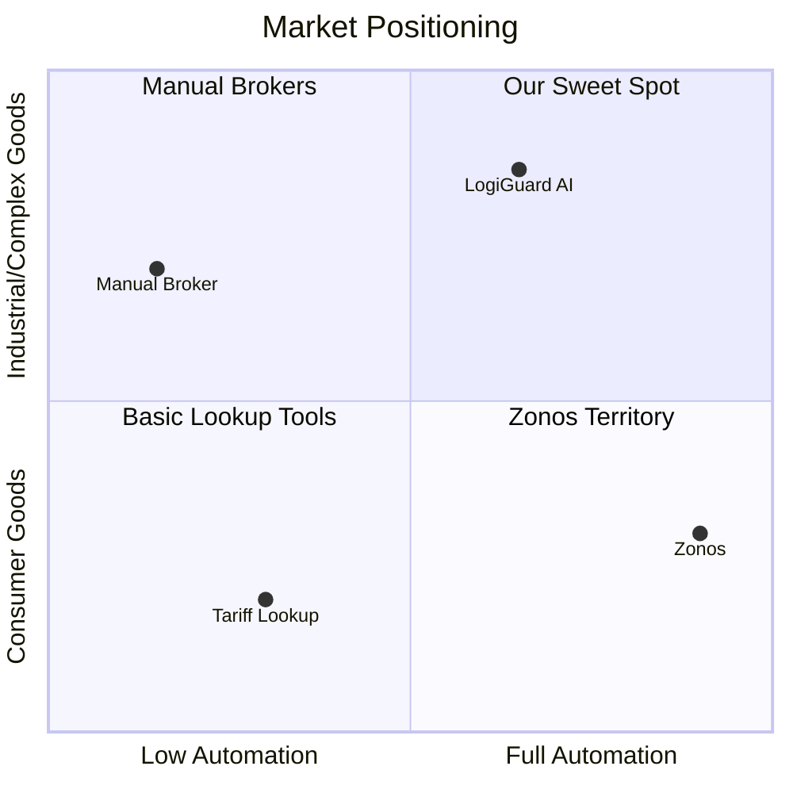

### Head-to-Head Comparison

| Dimension | Zonos | LogiGuard AI |
|---|---|---|
| **Target User** | E-commerce retailer (Shopify, BigCommerce) | Freight forwarder / customs broker |
| **Classification Approach** | Instant, fully automated | Stateful pipeline with human gate |
| **Legal Accountability** | Recently acquired broker arm (bolt-on) | Built-in from architecture day one |
| **Document Handling** | Product descriptions and SKUs | Full commercial invoice OCR |
| **Explainability** | Shows the code, not the reasoning | Shows GRI rules + Chapter Note citations |
| **Market Focus** | US/Western markets | India-specific (CBIC, ITC-HS, CAAR) |
| **Confidence Handling** | Always auto-classifies | Freezes at <85% for human review |
| **Goods Complexity** | Consumer goods (apparel, toys) | Industrial, machinery, chemicals |

### Our Competitive Advantages

1. **Legal Explainability:** Every classification comes with a legal citation trail — Section Notes, Chapter Notes, GRI rules used.
2. **India-First:** CBIC Chapter Notes, ITC-HS 2022, CAAR rulings — none of which Zonos has.
3. **Human Gate:** When the stakes are ₹5 crore, you don't want full automation. You want an AI recommendation with a human sign-off.
4. **Rule Engine:** Deterministic statutory exclusions that catch errors the LLM would miss.

### Features to Add from Zonos (Roadmap)

| Feature | Priority | Description |
|---|---|---|
| Restricted Goods Screening | 🔴 High | Pre-flight check against DGFT Negative List, SCOMET list |
| Undervaluation Detection | 🔴 High | Compare declared value against market benchmarks |
| Landed Cost Breakdown | 🟡 Medium | BCD + SWS + IGST calculation after classification |
| Batch Invoice Processing | 🟡 Medium | Process 50+ line items in a single batch upload |
| FTA Duty Optimization | 🟢 Low | Auto-detect FTA eligibility (India-Japan CEPA, etc.) |

---

## 17. Security & Compliance

### Current Security Measures

| Layer | Implementation |
|---|---|
| **CORS** | Configurable via `CORS_ORIGINS` (currently `["*"]` for development) |
| **Input Validation** | Pydantic models for all API inputs |
| **SQL Injection** | SQLAlchemy parameterized queries throughout |
| **File Upload** | Content-type validation, size limits |
| **Error Handling** | No stack traces leaked to API responses in production |

### Planned Security Enhancements

| Feature | Description |
|---|---|
| **JWT Authentication** | Role-based access (Admin, Broker, Viewer) |
| **API Rate Limiting** | Per-user request throttling |
| **Encryption at Rest** | AES-256 for stored PDFs |
| **Audit Log Immutability** | Append-only table with cryptographic hash chain |
| **RBAC** | Role-based access control for review approvals |

---

## 18. Future Roadmap

### Phase 2: Compliance Intelligence (Q3 2026)

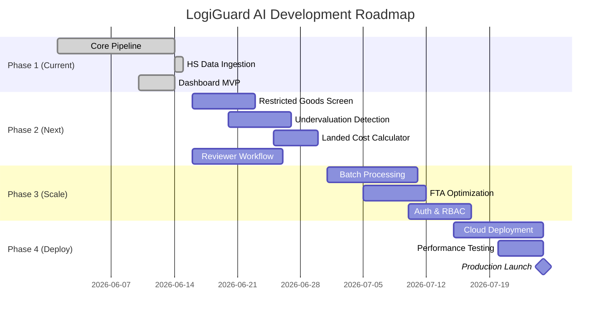

### Feature Priority Matrix

| Feature | Impact | Effort | Priority |
|---|---|---|---|
| Fix vector dimension mismatch | Critical (blocks RAG) | 1 hour | ✅ Done |
| Restricted Goods Screening | High (compliance) | 3 days | 🔴 P1 |
| Reviewer Detail Page (full UI) | High (core workflow) | 5 days | 🔴 P1 |
| Landed Cost Calculator | High (financial value) | 3 days | 🟡 P2 |
| Undervaluation Detection | Medium (fraud prevention) | 5 days | 🟡 P2 |
| Batch Processing | Medium (enterprise scale) | 3 days | 🟡 P2 |
| FTA Duty Optimization | Medium (competitive edge) | 5 days | 🟢 P3 |
| JWT Authentication | High (security) | 3 days | 🟢 P3 |
| Cloud Deployment | Critical (production) | 5 days | 🟢 P3 |

---

## 19. Deployment Architecture

### Current (Development)

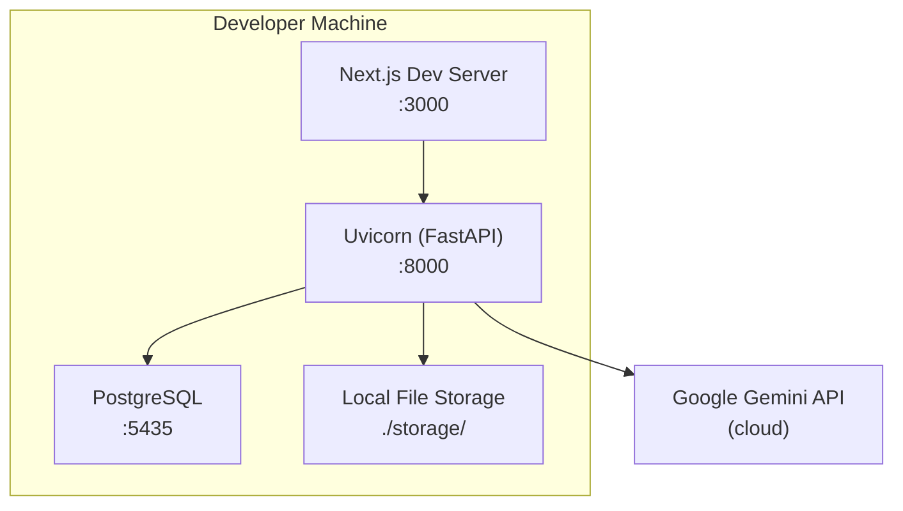

### Target (Production)

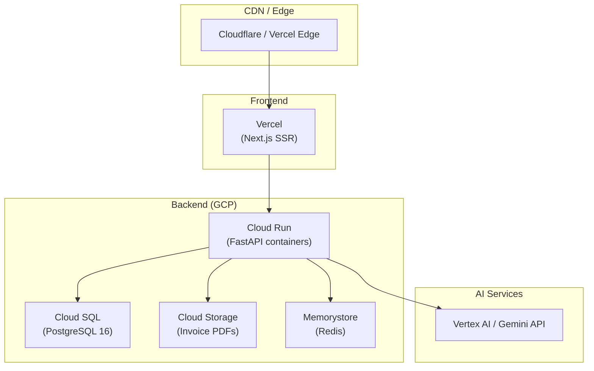

---

## 20. Appendix — File Structure

```
logiguard-ai/
├── .env                          # Environment variables
├── .gitignore
├── docker-compose.yml            # PostgreSQL + pgvector
├── README.md
│
├── backend/
│   ├── pyproject.toml            # PEP 621 dependencies
│   ├── seed.py                   # Database seeder (sample data)
│   ├── ingest_hs_csv.py          # HS code CSV ingestion script
│   ├── ingest_pdf_notes.py       # PDF notes + embedding ingestion
│   │
│   ├── data/
│   │   ├── hs_codes.csv          # Full HS 2022 hierarchy
│   │   ├── ITC-HS 2022 Schedule 1.pdf
│   │   ├── CHP_85.pdf
│   │   └── second general rule.pdf
│   │
│   ├── app/
│   │   ├── main.py               # FastAPI entry point
│   │   ├── config.py             # Pydantic Settings
│   │   ├── database.py           # SQLAlchemy async engine
│   │   │
│   │   ├── api/                  # REST API endpoints
│   │   │   ├── router.py         # Central router
│   │   │   ├── upload.py         # POST /upload
│   │   │   ├── process.py        # POST /process
│   │   │   ├── events.py         # GET /events (SSE)
│   │   │   ├── classify.py       # POST /classify
│   │   │   ├── review.py         # Review queue endpoints
│   │   │   ├── audit.py          # Audit trail endpoints
│   │   │   └── health.py         # Health check
│   │   │
│   │   ├── core/                 # Shared infrastructure
│   │   │   ├── llm.py            # LLM provider abstraction
│   │   │   ├── events.py         # SSE event publisher
│   │   │   └── storage.py        # File storage abstraction
│   │   │
│   │   ├── models/               # SQLAlchemy ORM models
│   │   │   ├── invoice.py        # Invoice + LineItem
│   │   │   ├── classification.py # TransactionState + Votes
│   │   │   ├── tariff.py         # TariffRule + HSTariffTree
│   │   │   └── audit.py          # AuditLog
│   │   │
│   │   ├── pipeline/             # Core processing pipeline
│   │   │   └── processor.py      # InvoiceProcessor orchestrator
│   │   │
│   │   ├── rag/                  # Retrieval-Augmented Generation
│   │   │   └── retriever.py      # MultiPathRetriever
│   │   │
│   │   ├── rules/                # Statutory Rule Engine
│   │   │   └── engine.py         # TariffRuleEngine
│   │   │
│   │   └── prompts/              # LLM prompt templates
│   │       └── templates.py
│   │
│   └── storage/                  # Local file storage
│
└── dashboard/
    └── logiguard-ai-dashboard/
        ├── package.json
        └── src/
            ├── components/
            │   ├── Dashboard.jsx
            │   ├── Upload.jsx
            │   ├── Invoices.jsx
            │   ├── Classify.jsx
            │   ├── ReviewQueue.jsx
            │   ├── ReviewDetail.jsx
            │   ├── Audit.jsx
            │   ├── Header.jsx
            │   └── Footer.jsx
            ├── layout/
            │   └── Layout.jsx
            ├── lib/
            │   └── api.js
            └── styles/
                └── globals.css
```

---

> **Document Version:** 1.0.0  
> **Last Updated:** June 14, 2026  
> **Classification:** Internal — Confidential
